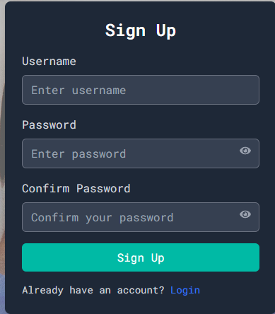
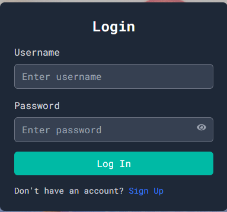
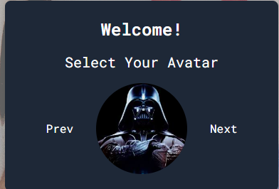
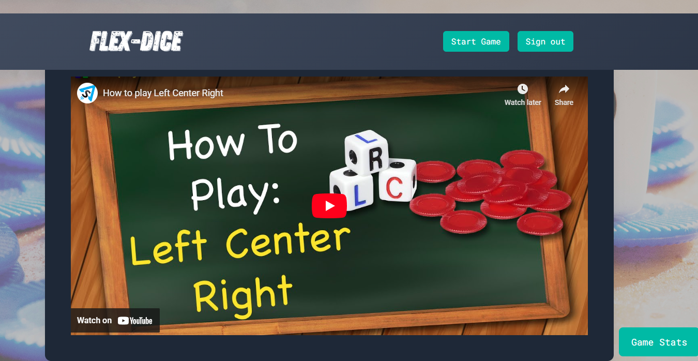
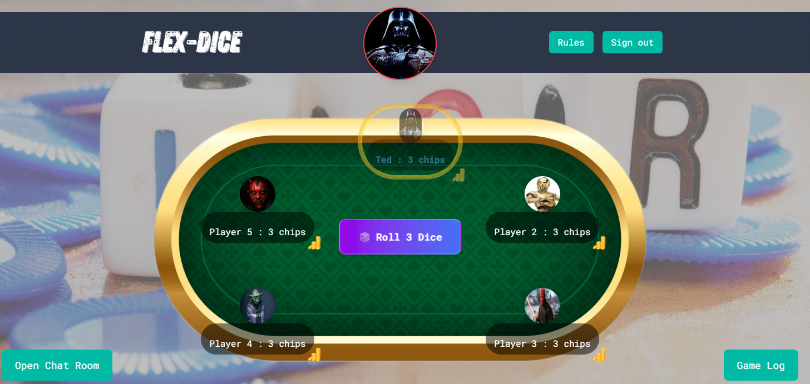
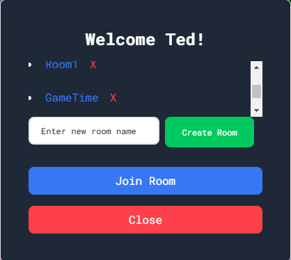
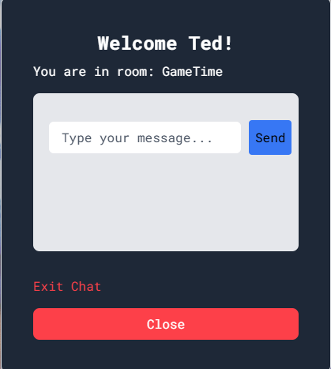
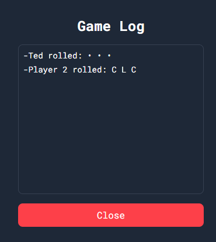

  # Title
   Flex-Dice
   

  ## Table of Contents

  - [Description](#description)
  - [Design](#design)
  - [Install](#install)
  - [Contributor](#contributor)
  - [License](#license)
  - [Questions](#questions)

  ## Description

   Flex-Dice is a single-player dice game where players compete against an AI opponent in a fun, fast-paced version of the popular game Left, Right, Center (LRC). The objective is simple: roll the dice, manage your chips, and be the last player with remaining chips to win. Flex-Dice combines the classic mechanics of LRC with the challenge of playing against a dynamic AI, offering an exciting experience that tests both your luck and strategy. Whether you're playing for fun or aiming to beat the AI, Flex-Dice guarantees an engaging and unpredictable gameplay experience!

  ## Design

    By building this game, you wanted to offer an easily accessible, fun, and competitive gaming experience without needing other players, allowing people to enjoy the thrill of the game anytime, anywhere.

## Try out our game! [Flex-Dice](https://flex-dice.vercel.app/)

  ## Install

    npm run start

  ## Contributor

    mvoidets, daniel, oscar, andrew

  ## License

    This is not licensed  

  ### Questions

  

  My GitHub profile is [Ddan71117](https://guthub.com/Ddan71117).

  Thank you for visiting my repository!